# Birds of Sri Lanka

---

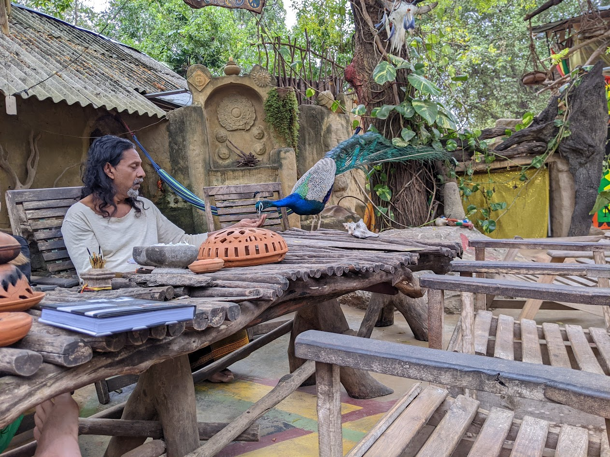
<!-- 

  
  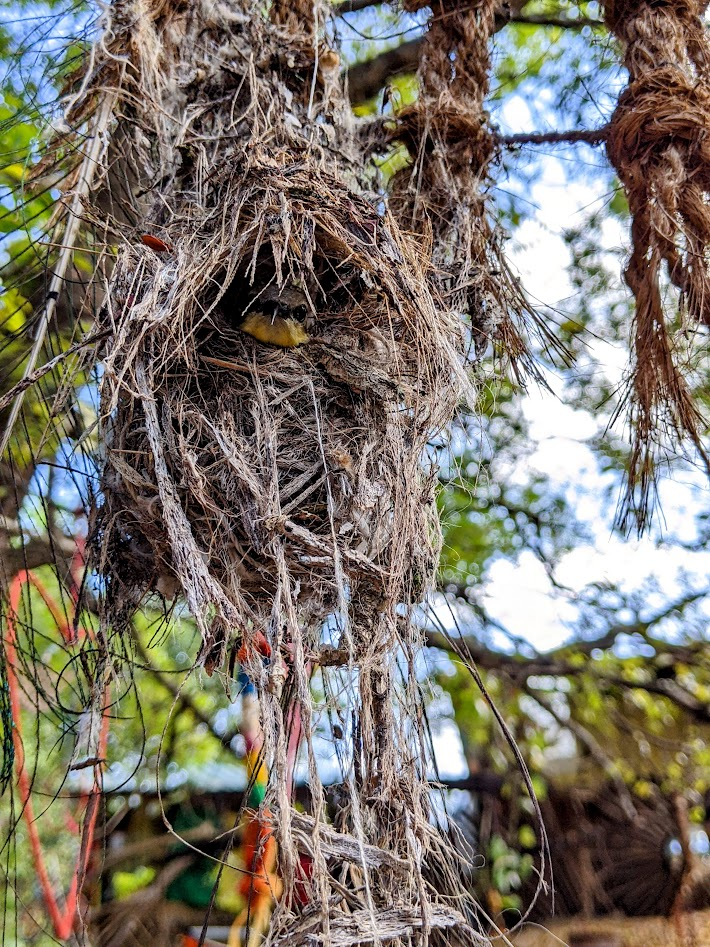

 -->

---

  
  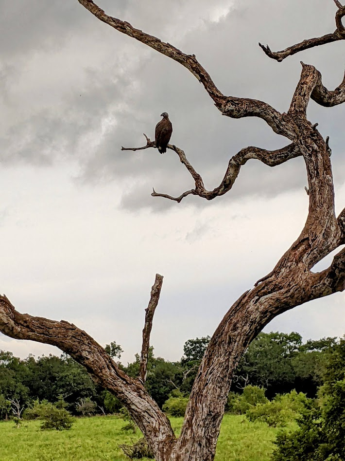
  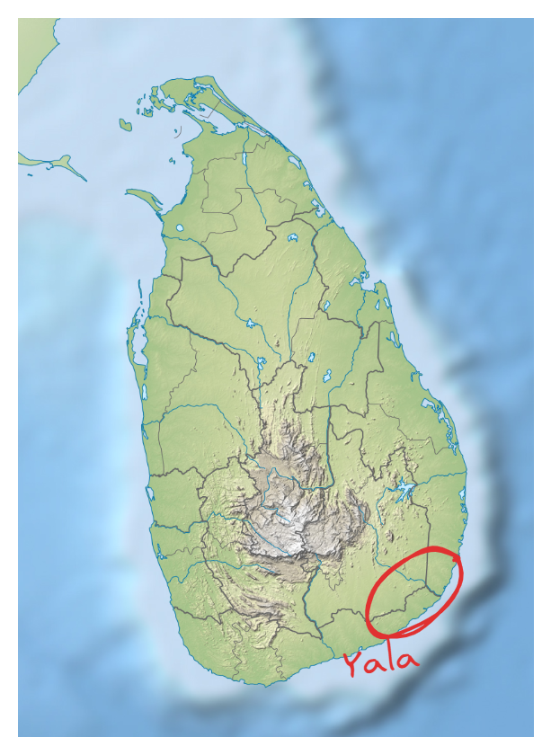
  
  

---

note: sinharaja rainfores

  
  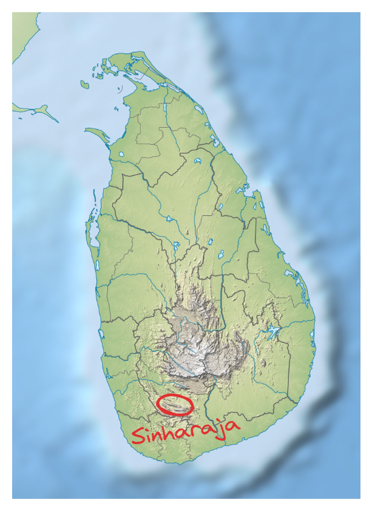
  
  

---

  
  
  
  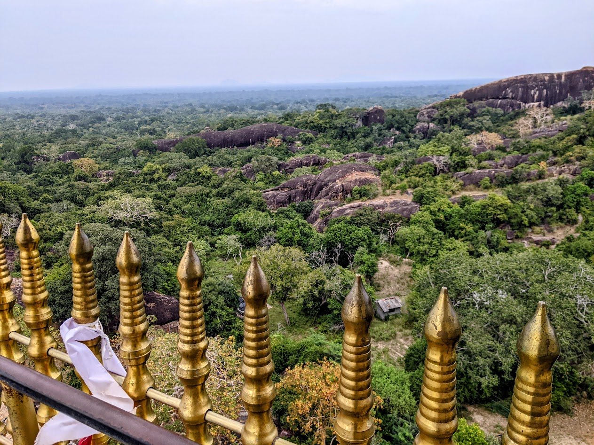

---

  
  
  
  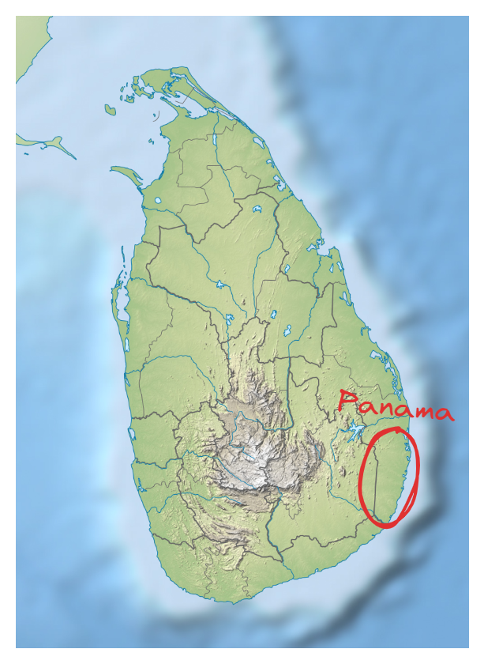
  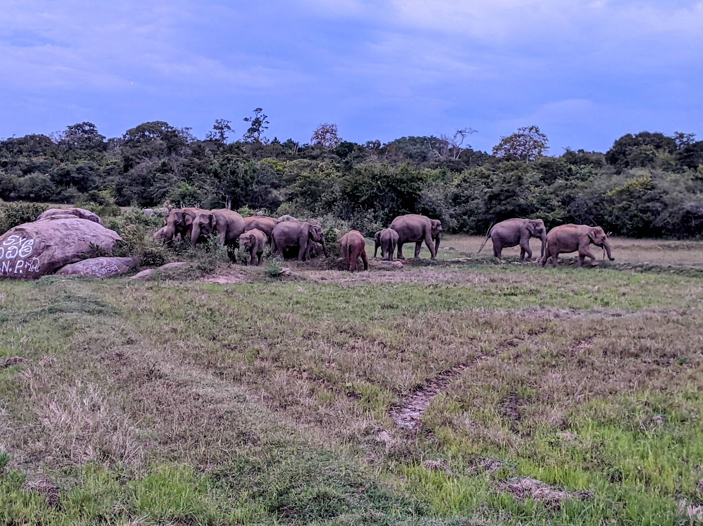

---

  
  
  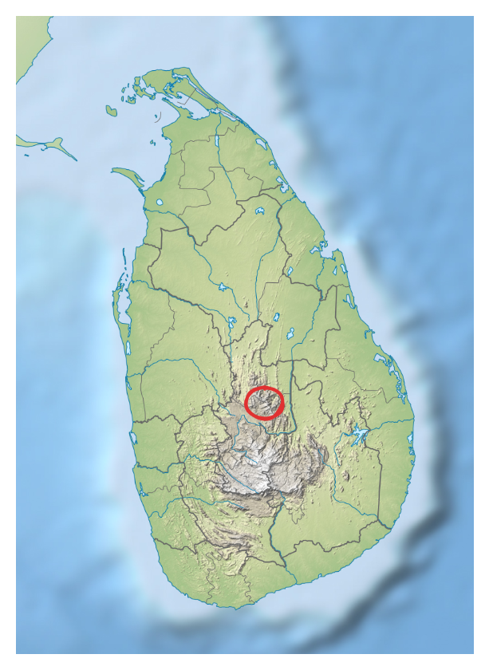
  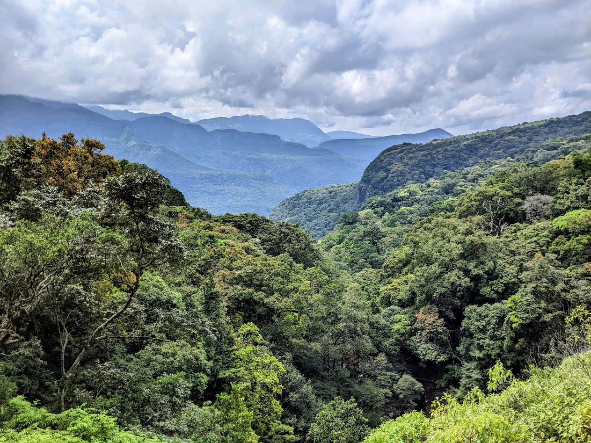
  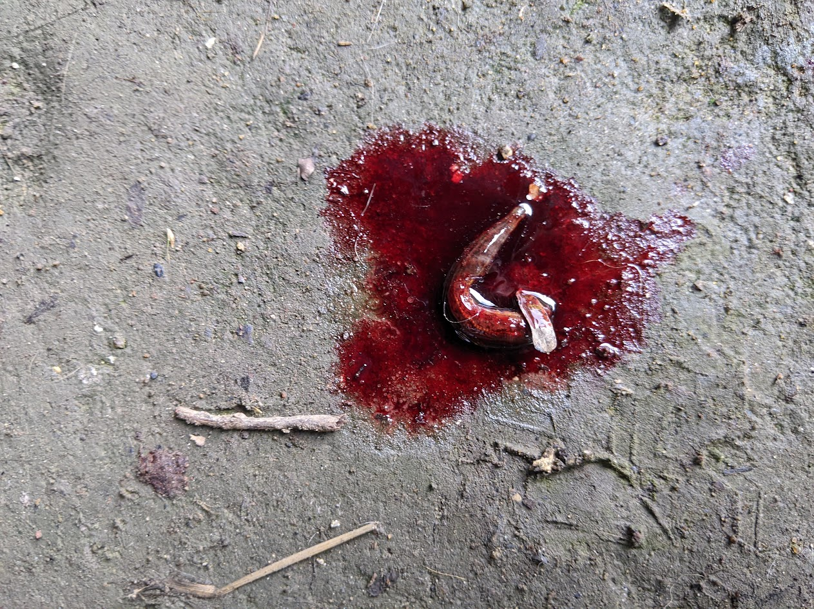
  

---

## Merlin

--

<!--  -->
